# 1. Introduction:
Les langages de programmation sont les outils utilisés souvents pour "se communiquer" avec un ordinateur et lui donner les instructions à faire, et pour que l'ordinateur peut "comprendre" ce que le programmeur veux malgré la différence entre le langage humain (français, anglais, ...) et le langage machine (binaire), une multitudes d'approches sont venu à l'existance:
- **Les compilateurs:** Des programmes qui traduisent le programme d'un langage de programmation de haut niveau (proche du langage humain) vers le langage machine, sauvegardé dans un fichier binaire executable (standalone), utilisé pour plusieurs langage notament (**C/C++**, **Rust**, **OCaml**, ...etc).
- **Les interpreteurs:** Des programmes qui traduisent le programme à la volée, il ne sauvegarde aucun fichier executable, mais execute le code directement, utilisé pour plusieurs langages (**Python**, **Javascript**, **PHP**, ...etc).
Dans le contexte de ce cours, et de ce projet universitaire, on va implémenter un interpreteur de langue pour un langage nommé **LATSI** (**L**angage **T**rés **S**imple d'**I**instructions).

# 2. Présentation du langage LATSI:
**LATSI** (**L**angage **T**rés **S**imple d'**I**instructions) est un langage d'instructions qui sert à coder des programmes simples.
- **exemple:**
```
0 REM "This program reads data and performs simple calculations and then displays the result to the screen"
1 IMPRIME "Votre année de naissance: "
2 ENTREE A
3 IMPRIME "Vous avez: ", (2024 - A), " ans"
4 NL
```
## 2.1. Les instructions basiques du langage LATSI:
Le langage LATSI possède un ensemble d'instructions simples qui composent un programme.
- **IMPRIME:** instructions qui prend un ensemble *infiini* de paramètre et les imprime 
```
1 IMPRIME "hello", "world", 2+3
>> helloworld5
```
- **ENTREE:** instruction qui prend un ensemble de variables et lis leurs valeurs de l'entrée standard.
```
1 ENTREE A, C, F
2 IMPRIME A, C, F
<< 10
<< 25
<< 30
>> 10
>> 25
>> 30
```
- **NL:** instruction qui imprime un saut de ligne.
```
1 IMPRIME "HELLO"
2 NL
>> HELLO
>>
```
- **VAVERS:** instruction qui prend un seul paramètre (un numéro de ligne) et saute vers la ligne designée.
```
1 IMPRIME "HELLO "
2 VAVERS 4
3 IMPRIME "WORLD"
4 IMPRIME "MOM"
>> HELLO MOM
```
- **FIN:** une instruction sans paramètres qui termine le programme (avec succés).
```
1 IMPRIME "HELLO "
2 IMPRIME "WORLD"
3 FIN
4 IMPRIME "YOU WON'T SEE ME"
>> HELLO WORLD
```
- **REM:** REM n'est pas une instruction, mais elle designe un commentaire (REM comme REMarque).
```
1 REM "CETTE LIGNE NE SERT A RIEN"
```
- **SI c ALORS i:** c'est une instruction conditionnelle, si la condition **c** est satisfaite, l'instruction **i** est exécutée, sinon le programme passe à la ligne suivante.
```
1 A = 10
2 B = 15
3 SI A > B ALORS IMPRIME "A EST PLUS GRAND"
4 SI B > A ALORS IMPRIME "B EST PLUS GRAND"
5 NL
>> B EST PLUS GRAND

```
## 2.2. Les variables, les types de données, et les opérateurs:
Le langage LATSI présente un seul type de données: les **entiers**
### 2.2.1. Variables:
Lors de l'execution d'un programme LATSI, la mémoire aura un espace mémoire pour 26 variables notées par les caractères de l'alphabet Latin: "A, B, C, ..., Z" et tous ont le même type: entiers, et sont initialisées au début par 0.
Les variables peuvent changer leurs valeurs avec des affectations ou lecture de l'entrée standard (**une entrée fausse cause une erreur d'execution**)
```
1 A = 10
2 B = 50
3 ENTREE C
4 IMPRIME A
5 NL
6 IMPRIME B
7 NL
8 IMPRIME C
9 NL
<< 3
>> 10
>> 50
>> 3
```
### 2.2.2. Types de données:
LATSI possède deux types de données:
- **Entiers:** cela constitue les variables et tous calcul possible.
- **chaine de caractères (string):** des chaines de caractères, utilisées pour l'affichage d'informations (que dans **IMPRIME** et **REM**).
### 2.2.3. Opérations arithmétiques et logiques:
Les entier dans un prorgamme LATSI supportent les opérations arithmétiques(addition, soustraction, multiplication, division) et logiques (>=, >, <=, <, =).
- Priorité des opérateurs:
- Comme dans les mathématiques, les opérateurs arithmétiques +, - s'appliquent de gauche à droite, même chose pour \*, /.
- les opérateurs logiques de comparaison s'appliquent que pour deux valeurs (pas de chaine de comparaison).
```
1 IMPRIME 1+3-2
2 NL
3 IMPRIME 5*7/2
4 NL
5 IMPRIME 3*(2+7)
6 NL
7 SI 10 > 2 ALORS IMPRIME "true"
8 NL
>> 2
>> 17
>> 27
>> true
```

# 3. Fonctionnement interne de l'interpreteur du langage LATSI:
## 3.1. Spécifications de l'environnement du developement:
L'interpreteur du langage LATSI est developé avec le langage **OCaml** en utilisant les outils **OCamllex** pour le lexeur et **Menhir** pour le parser.
L'interpretation se fait en 3 étapes:
1. **Lexing:** se fait en analysant le code et l'extraction des tokens.
2. **Parsing:** analyse sélantique du langage, et construction de l'arbre de syntaxe.
3. **Execution:** Execution du code.
## 3.2. Lexing:
Le programme LATSI possède un ensemble de mots clefs, des noms de variables, des données (entiers ou chaines de charactères)...
### 3.2.1. Les mots clefs:
Désigne les termes propres au langage et les instructions qu'il peut executer.
- **IMPRIME**, **ENTREE**, **SI**, **ALORS**, **REM**, **NL**, **FIN**, **VAVERS**.
### 3.2.2. Les données:
Les données sont soit des chaines de caractères ou des entiers, définies par les expressions régulières quivantes.
 - **Les entiers:**
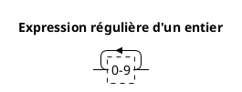
- **Les chaines de caractères:** forcément des chaines d'une seule ligne qui peuvent inclure tout caractère différent de **"** et **\\n (saut de ligne)**
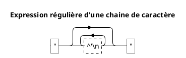
### 3.2.3. Les variables:
Les variables (comme mentionné avant), sont 26 et chacune est représenté par une lettre majiscule.

### 3.2.4. Les opérateurs:
- **Les opérateurs arithmétiques:** ils sont représentés par les signe connus (+, -, \*, /).
- **Les opérateurs de comparaison:** ils sont représentés par l'expression régulière suivante.
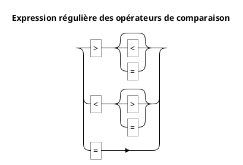
### 3.3.4. Fonctionnement du lexeur:
- Le lexeur analyse les expressions rationnelles du code **LATSI** et retourne pour chaque élément le token spécifique.
- Les noms des tokens sont utilisés de façon à être plus simples à retenir (exactement le même nom pour les instructions et les mots clefs, et le nom de l'opérateur pour les opérateurs, les variables sont représentés par des tokens **VAR(nom_var)**, et les entiers sont représentés par **ENTIER(valeurs_entière)**, les chaines de caractères sont représentés par **CHAINE(chaine)**). Sauf le cas de **REM** qui prend la chaine comme paramètre (puisque c'est un commentaire donc on peut le regroupés directement).
- Avec l'ajout des autres tokens utiles comme les paranthèses (utiles pour les expressions mathématiques...), le saut de ligne (qui marque la fin d'une instruction), les virgules (pour séparer les paramètres des fonctions d'entree ou de sorties), EOF pour marquer la fin du fichier.
```ocaml
type token =
(*data*)
| ENTIER of int
| CHAINE of string
(*built-in functions*)
| IMPRIMER
| ENTREE
| NL
(*keywords*)
| SI
| ALORS
| VAVERS
| REM of string
| FIN
(*arithmetic operators*)
| ADD
| SOU
| MUL
| DIV
(*comparison operator*)
| EG
| SUP
| INF
| SUPE
| INFE
| DIFF
(*seperators*)
| PARG
| PARD
| VIRG
| SAUT
(*spaces are ignored*)
(*variables*)
| VAR of char
(*end of file*)
| EOF
```
### 3.2.5. Exemple:
```
1 IMPRIME "HELLO", " WORLD, ", 1, " + ", 1, " = ", 1+1
```
devient:
```ocaml
[IMPRIME, CHAINE("HELLO"), VIRG, CHAINE(" WORLD"), VIRG, ENTIER(1), VIRG, CHAINE(" + "), VIRG, ENTIER(1), VIRG, CHAINE(" = "), VIRG, ENTIER(1), ADD, ENTIER(1)]
```
## 3.3. Parsing:
Le langage LATSI suit un nombre de règle de codage présentés dans une grammaire précise.
### 3.3.1. Régles du langage LATSI:
#### Programme:
Un programme LATSI doit ontenir au moins une ligne, un programme vide génère une erreur.
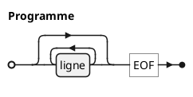
#### Lignes:
Chaque ligne doit être présentée par un nombre puis l'instruction à éxecuter, et se termine soit par un saut de ligne ou une fin de fichier.
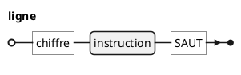
#### Instructions:
Les instructions sont présentés par une des fonctions possibles avec l'ensemble de paramètres possibles, ou une affectation de valeurs.
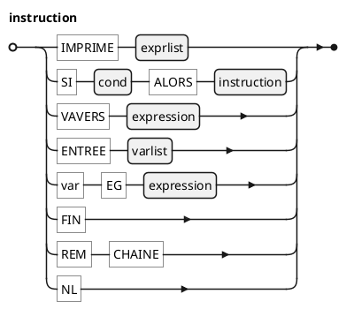
#### Liste des expressions:
La liste des expressions est utilisée pour l'affichage des données, et se forme d'une séquence non-vide d'expressions et de chaines.
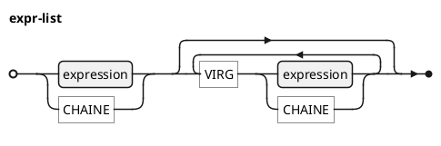
#### Conditions:
Les conditions sont des comparaisons dans LATSI, elles evaluent à **Vrai (true)** ou **Faux (False)**.
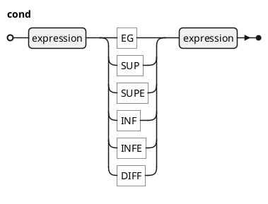
#### Liste des variables:
C'est une liste des variables utilisée pour l'instruction **ENTREE**.
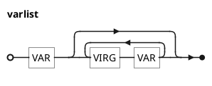
#### Expressions:
Les expressions en LATSI sont des expressions mathématiques qui s'évalue à une valeur entière.
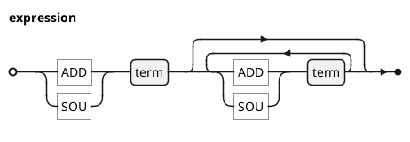
#### Termes:
Les termes sont les expressions à evaluer lors d'une addition ou soustraction.
Ils peuvent être des facteurs ou des multiplications/divisions de facteurs
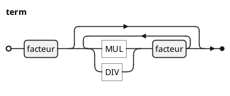
#### Facteurs:
Les facteurs sont les valeurs en bas de l'arbre de calcul mathématique, elles peuvent être des **valeurs constantes**, des **variables** ou des **expressions (entre parenthèses)**
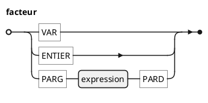
### 3.3.2. Construction de l'arbre syntaxique OCaml:
La conversion d'un code LATSI en une structure arborescente OCaml se fait en plusieurs étapes et necessite des structures bien définies.
#### Types OCaml utilisées:
Pour chaque non terminal, on a défini un type spécifique qui contient tous les valeurs possibles (correspondantes aux régles de construction définies), et aprés chaque code se convertit vers un arbre bien définie.
- **Exemple de code:**
```
1 IMPRIME "BONJOUR", " PARIS
3 A = 1 + 2 * 7 + 5
2 NL
5 NL
4 IMPRIME "A = ", A
```
Devient:
```ocaml
PROGRAMME([
LIGNE(1, IMPRIME([CHAINE("BONJOUR"), CHAINE("PARIS")])), 
LIGNE(2, NL),
LIGNE(3, AFF('A', ADD(FACT(CONST(1)), ADD(MUL(CONST(2),CONST(7)), FACT(CONST(5)))))), 
LIGNE(4, IMPRIME([CHAINE("A = "), EXPR(POS(FACT(VAR('A'))))])), 
LIGNE(5, NL)
])
```
# 3. Les extensions réalisées :
## 3.1. Affectations simultanées:
C'est de réaliser une affectation simultanée d'un ensemble d'expressions dans un ensemble de vairables (les variables et les expressions doivent être entre parenthèses dans la grammaire pour éviter des conflits avec les affectations multiples (section suivante).
**Exemple de code:**
```
0 REM "X, Y et Z ont comme valeur initiale 0"
1 (X, Y, Z) = (1, 2+5, 3+X)
2 IMPRIME "X = ", X
3 NL
4 IMPRIME "Y = ", Y
5 NL
6 IMPRIME "Z = ", Z
7 NL
8 REM "Z est 3 car l'instruction prend les anciennes valeurs des variables"
>> X = 1
>> Y = 7
>> Z = 4
```

## 3.2. Affectations multiples sur une ligne:
**Exemple de code:**
```
1 X=1, Y=2+4, Z = X + Y
2 IMPRIME "X = ", X
3 NL
4 IMPRIME "Y = ", Y
5 NL
6 IMPRIME "Z = ", Z
7 NL
8 REM "Z est 7 car la valeur de Y prise est 6, la dernière valeur "
>> X = 1
>> Y = 6
>> Z = 7
```
## 3.3. Instruction SOUSROUTINE et RETOURNE:
`SOUSROUTINE <expression>` pour sauter à une ligne en gardant le numéro de l'instruction suivante et `RETOURNE` pour revenir après la dernière sous-routine exécutée.
**Exemple de code:**
```
1 REM "Exemple de SOUSROUTINE et RETOURNE"
2 IMPRIME "Début"
3 SOUSROUTINE 6
4 IMPRIME "Retour à la ligne 4"
5 FIN
6 IMPRIME "Dans la sous-routine"
7 NL
8 RETOURNE
>> Dans la sous-routine
>> Retour à la ligne 4
>> 
```

# 4. Répartition du travail :
- Analyse grammaticale pour Hamame.
- Analyse lexicale pour Lynda .
- Chacun de nous a développé certaines extensions . 

# 5. Compilation avec Makefile :
Pour compiler et exécuter le programme LATSI, nous avons choisi d'utiliser un Makefile. Voici les commandes à utiliser :

# Compilation :
- Nettoyer les fichiers temporaires et les fichiers objets précédents :
```bash
make clean
```
- Compiler tous les fichiers nécessaires et générer l'exécutable main :
```bash
make
```
# Exécution :
- Exécuter le programme avec un fichier d'entrée contenant du code LATSI :
```bash
./main <nom_fichier>
```
